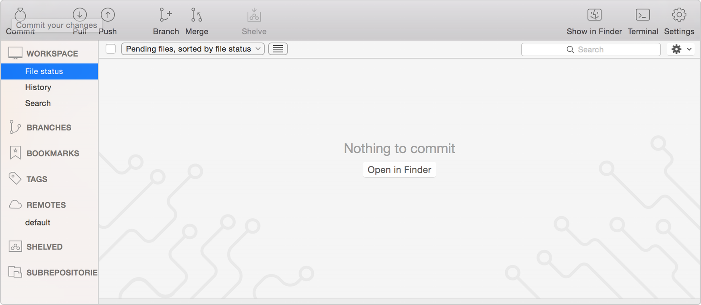
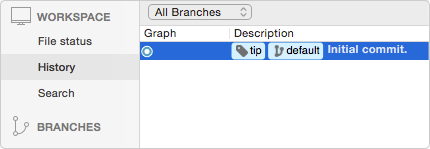

# Инструкция по использованию SourceTree

## Содержание

* [Установка SourceTree](#install-sourcetree)
* [Создание Git-репозитория на сервере](#create-a-git-repository)
* [Клонирование вашего репозитория на локальный компьютер](#copy-your-repository-and-add-files)
* [Отправка файла в Bitbucket](#push-a-file-to-bitbucket)
* [Создание новых веток в Bitbucket](#create-a-branch-and-make-a-change)
* [Слияние веток в SourceTree](#merge-file-changes-from-a-branch)
* [Получение изменений из удаленного репозитория](#pull-changes-from-your-repository-on-bitbucket)
* [Получение изменений из Bitbucket](#push-your-change-to-bitbucket)
* [Сочетание клавиш в Bitbucket](#sourcetree-keyboard-shortcuts)
* [Блог SourceTree](#sourcetree-blog)


#### Install SourceTree

Нажмите [сюда](https://www.sourcetreeapp.com/), чтобы скачать и установить SourceTree.


#### Create a Git repository

Рассмотрим создание репозитория на сервере [Bitbucket](https://bitbucket.org).
Работа с репозиторием на других серверах аналогична.

Выполните следующие действия, чтобы создать свой репозиторий.

1. Из [Bitbucket](https://bitbucket.org) нажмите в верхней части страницы на **Repositories - Create repository**.


Система отобразит страницу **Create a new repository**. Потребуется некоторое время, чтобы пересмотреть содержание диалога. За исключением **Repository type** все, что вводите на этой странице, сможете позже изменить.


2. Введите *BitbucketStationSupplies* в поле **Name**. <br/>
Bitbucket использует **Name** в URL репозитория. Например, если пользователь *the_best* создаст репозиторий с именем *awesome_repo*, то URL репозитория будет https://bitbucket.org/the_best/awesome_repo.
3. **Access level**. Частный репозиторий только для вас и тех, кто вам предоставляет доступ к репозиторию. Если этот флаг не установлен, каждый может увидеть ваш репозиторий.
4. В зависимости от типа репозитория, можно выбрать git или mercurial для **Repository type**. Имейте в виду, что вы не сможете изменить **Repository type** после нажатия кнопки **Create repository**.
5. Нажмите  **Create repository**.
Bitbucket создаст ваш репозиторий и отобразит страницу **Overview**.

Чтобы ознакомиться с тем, как создать репозиторий на GitHub, нажмите [сюда](https://help.github.com/articles/create-a-repo/).


#### Copy your repository and add files

Используйте SourceTree для клонирования вашего репозитория на локальный компьютер без использования командной строки.

1. Вероятно, вы будете работать в нескольких репозиториях. Поэтому лучше всего содержать все репозитории в одном месте. Для этого создайте директорию на локальном компьютере и назовите ее *repos*.
2. На странице **Overview** вашего репозитория *BitbucketStationSupplies* в Bitbucket нажмите кнопку **Clone in SourceTree**.


3. Из **Clone New** диалогового окна измените **Destination Path** на *<local directory>/repos/bitbucketstationsupplies*. Этот путь указывает на директорию, в которой будет создана директория с репозиторием. Поле **Name** останется неизменным с именем директории репозитория.


4. Нажмите на кнопку **Clone**.


#### Push a file to Bitbucket

1. Дважды щелкните на *bitbucketstationsupplies* репозиторий в *SourceTree* и увидите, что нет ничего, что можно было бы отправить из локального репозитория в удаленный репозиторий.



2. Используйте текстовый редактор и добавьте некоторый текст. Например,
```
space ice cream
nerf darts
telescope light shield
```

Сохраните файл как *supplies.txt* в *bitbucketstationsupplies* директории на вашем локальном компьютере. Файл *supplies.txt* появится в *SourceTree*, так как вы создали его в локальном репозитории.


3. Чтобы добавить изменения в репозиторий, из меню *options* для файла *supplies.txt* выберите **Stage file**


4. Нажмите кнопку **Commit**.
5. В диалоговом окне введите сообщение об изменении, например, "Initial commit."


6. Нажмите кнопку **Commit** в диалоговом окне. Ваш файл будет закоммичен в проект.



До этого момента все изменения, что вы сделали на вашем локальном комьютере, невидимы для вашего репозитория Bitbucket до тех пор, пока вы не отправите эти изменения в свой удаленный репозиторий Bitbucket.


7. Из *SourceTree* нажмите кнопку **Push**, чтобы отправить ваши изменения на сервер.


#### Create a branch and make a change

Покажем как работать с ветками в *SourceTree*. Для этого создадим новую ветку.

1. Из *SourceTree* нажмите кнопку **Branch**.


2. Увидите следующее всплывающее окно. Поле **New Branch** показывает имя вашей ветки, введем, например, *wish-list*.


3. Нажмите **Create Branch**.

4. Из *SourceTree* нажмите кнопку **Show in Finder**. Увидите следующую директорию.


5. Откройте файл *supplyrequest* в текстовом редакторе и сделайте в нем изменения.
Например, добавьте следующую строку:

```
<li>anti-gravity speakers</li>
```

Сохраните файл.

6. Откройте панель *view* в *SourceTree* и увидите не добавленные изменения.


7. Чтобы добавить изменение, выберите **Stage file** из дополнительного меню, нажав на *supplies.txt* файл. 


8. Нажмите на кнопку *Commit* и добавьте сообщение, например, "Adding an item for my wish list.".
В *SourceTree* можете увидеть, что файл был обновлен в *wish-list* ветке.


#### Merge file changes from a branch

1. Сначала нужно вернуться в основную ветку, для этого в левостороннем меню выберите *Branches*.
Увидите ветки *wish-list* и *master*.
Сделав двойной щелчок на ветку *master*, переключитесь на эту ветку.


2. Нажмите на кнопку *Merge*.


3. В сплывающем окне увидите изменение в ветке *wish-list*. Вы должны подтвердить, что хотите добавить изменение из этой ветки в основную ветку.
Если есть неоходимость добавить изменения из других веток в основную ветку, то  для слияния с основной веткой выбирается нужная ветка путем нажатия на нее.


4. Увидите следующее сообщение:


Нажмите кнопку **OK**.

5. Основная ветка обновится, объединится с *wish-list* веткой. В *SourceTree* увидите следующее:


Более подробно о том, как использовать слияние веток, можно посмотреть [тут](https://blog.sourcetreeapp.com/2012/08/21/merge-or-rebase/).

Более подробно о том, как разрешать конфликты слияния, можно посмотреть [тут](http://we.easyelectronics.ru/CADSoft/git-v-domashnem-hozyaystve-chast-2-uou-uou-potishe-ne-konfliktuy.html).

#### Pull changes from your repository on Bitbucket

Чтобы получить файлы из удаленного репозитория, сделайте следующие действия.

1. Откройте ваш репозиторий в *SourceTree* и нажмите кнопку **Pull**.


Появится всплывающее окно, указывающее, что произойдет слияние репозитория Bitbucket и локального репозитория.

2. Нажмите **OK** в данном диалоговом окне. *Sourcetree* автоматически произведет слияние.


3. Перейдите в директорию своего репозитория на вашем локальном комьютере и вы увидите то, что только что добавили.


#### Push your change to Bitbucket

1. Из *SourceTree* нажмите кнопку **Push** для отправления ваших изменений.
2. Из появившегося диалогового окна нажмите кнопку **OK**, чтобы отправить изменения на удаленный сервер.


#### SourceTree Keyboard Shortcuts

##### Navigation & Menus

| Action | Shortcut |
|:-:|:-:|
| File Status Screen   | cmd + 1 |
| Log Screen           | cmd + 2 |
| Search Screen        | cmd + 3 |
| Repo select window   | cmd + b |
| New repo             | cmd + n |
| Command history      | cmd + shift + w |
| Hide/show sidebar    | cmd + shift + k |
| Spelling and grammar | cmd + shift + ; |
| Settings             | cmd + , |
| Help                 | cmd + shift + / |

##### Staging & Commit Operations

| Action | Shortcut |
|:-:|:-:|
| Commit All… Screen   | cmd + shift + c |
| Commit options       | cmd + shift + o |
| Reset Selected File  | cmd + shift + r |
| Diff                 | cmd + d |
| Remove Selected File | cmd + delete |
| Search               | cmd + shift + h |
| Refresh              | cmd + r |
| Find                 | cmd + f |

##### Branch Operations

| Action | Shortcut |
|:-:|:-:|
| Stash   | cmd + shift + s |
| Add Tag | cmd + shift + t |
| Branch  | cmd + shift + b |
| Merge   | cmd + shift + m |

##### Repository Operations

| Action | Shortcut |
|:-:|:-:|
| Fetch                | cmd + shift + f |
| Pull from repository | cmd + shift + l |
| Remotes	             | cmd + shift + , |
| Open Working Copy    | cmd + o |

##### Window 

| Action | Shortcut |
|:-:|:-:|
| Quit         | cmd + q
| Close window | cmd + w
| Hide         | cmd + h
| Minimise     | cmd + m


#### SourceTree Blog

Блог SourceTree можно посмотреть [тут](https://blog.sourcetreeapp.com/).